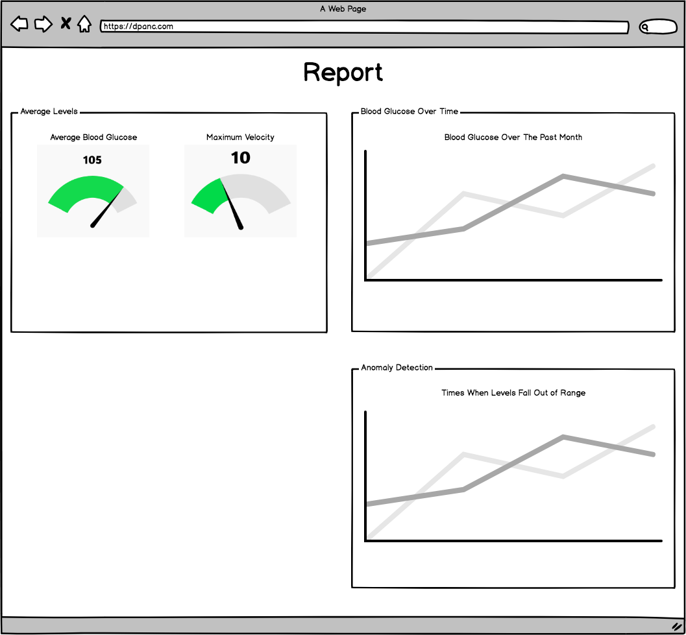
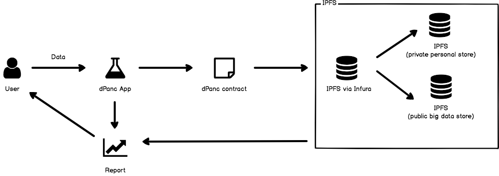

# dPanc

## Description
dPanc aims to leverage Ethereum network's distributed and immutable nature to provide a platform for diabetics to monitor their health.

## Today's Problem
Today in the US, a diabetic patient will typically visit their doctor for a checkup once every few months.

The standard checkup involves testing and recording the patient's blood glucose level, and comparing the results with data from previous visits.

If the patient can afford to own a blood glucose testing kit and has the ability to export/record the data from the device, then the doctor can assess the patient's situation better as there are more data points to build a better model of the patient. If not, then the doctor has to rely on the data generated every visit.

A person's blood glucose level can be affected by many different factors such as diet, exercise, and sleep. There is a general "acceptable" range for blood glucose level, but adjusting the level depends on a person-to-person basis so most treatment options rely on self-care.

Unfortunately, the US healthcare system is incredibly expensive for patients so many Type 1 Diabetics will sacrifice their health to save money.

## The Solution: dPanc
dPanc's purpose is to leverage blockchain technology to empower type 1 diabetics to take full control their health.

By utilizing the Ethereum network to digitalize a user's diabetic health record, dPanc is a full end-to-end solution filling a major gap in the diabetes ecosystem.

Users will upload their measurements via file or manual entry, and receive a a health report including comparisons to previous uploads and other users with similar lifestyles.

## MVP Features
- "One Month Report"
  - Avg glucose level
  - Max velocity
  - Graph of avg glucose level by time
  - Anomaly detection
- MetaMask integration
- Global view of statistics

The current committed MVP will allow users to do a once-a-month upload of their measurements to instantly receive a report regarding their health for the past month.

Users will have to use MetaMask to authenticate and submit their data to our contract.

The user's data will also be batched and saved to the public big data store to provide a global summary view.

## TODO: Full Product
- Machine learning model/module to give recommendations
- Ability to enter timestamped data for any period of time
- Mobile app to enter measurements on the go

## Technical Details

### Data Analysis
We plan on using a number of mathematical tools to gain valuable insights from the data we are collecting and processing.

To start, we can measure a variety of metrics that the typical type one diabetic would not receive from their doctor. This includes, but is not limited to:
- Maximum velocity of blood glucose (in mg/dL/min): this is a useful component in building predictive models because it sets safe upper bounds in all prediction algorithms
- Pattern recognition of consistent glucose trends appearing across a similar time of day
- A great approximation of the Hemoglobin A1c (HbA1c) of that diabetic, which is used as a measure of diabetic health

We can use methods from Numerical Analysis, Statistics, and Machine Learning to build these tools. We will start with simple, low level tools, and then use those to build larger, more useful tools (e.g. a predictive model which can measure it’s own effectiveness and adjust accordingly).

### Tech Stack
dPanc is a full end-to-end service and platform featuring:
- Node.js web application
- Infura for access to Ethereum and IPFS
- Solidity contract for uploading/retrieving patient data on IPFS
- Java service for patient data batching & aggregation

### Web Application

Users will interact with a Node.js web application integrated with web3 via Infura/MetaMask. Users will fill out a simple form and attach their measurements to generate their report.


The user will then be redirected to the Report page where they can view their results.



### Data Flow



A user's upload will go through a Solidity contract to be stored in two data stores in IPFS:
- private personal store 
- public big data store

The private personal store is a history of a user's data (by Ethereum address). This store is only accessible by the user (Ethereum address) that uploaded the data.

The public big data store is a global store of everybody's measurements. Once a day or so, the Java service will collect all submitted data to strip out any identifying details and do a batch upload of all the data into the public big data store.

The purpose of the public big data store is to provide an easy way to access the big data to apply machine learning models, and to expose this valuable dataset to researchers.

### Contract
The dPanc contract is used to store IPFS hashes of the actual data files.

```
contract dPanc {
  mapping(address => string) userDataLocMapping // Option 1: Provide a mapping to the IPFS hash of the document that lists out all the IPFS keys of their data
  mapping(address => User) userMapping          // Option 2: Use a struct to hold a user's metadata and an array of IPFS keys

  struct User {
    address addr;
    string[] ipfsHashes; // Holds the IPFS hashes of a user's data. Index 0 holds the oldest user's data (month).
  }

  ...
}
```

### Data Storage
For the MVP, we will require that a month's data be uploaded at once.

This greatly reduces the complexity of data storage as we do not have to involve complex scaling solutions as there are only 12 months in a year (12 data points per year).

### TODO: Ability to enter timestamped data for any period of time

The challenge with this is managing the time windows of the user's data. Specifically, we need to design an efficient means of storing data such that uploading AND retrieving the data is quick.

A naive implementation is to save a user's data in a linked list style structure, but this solution will not scale well over time. Additionally, if a user enters in their data at irregular intervals (ex. switching from daily to weekly) then this will complicate things.

Depending on the user's blood glucose device, they may also opt to upload their data on a daily basis or monthly basis so the solution must be able to handle time windows of varying size.
