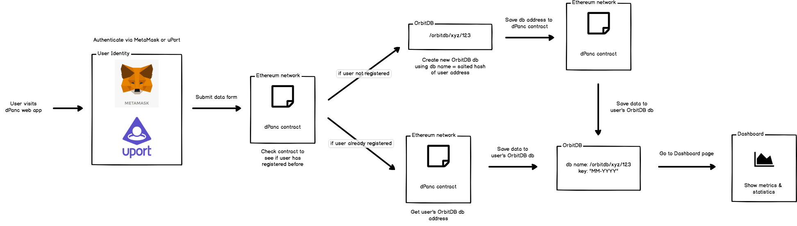

# dPanc
Self Health Management dApp for Diabetes

# Overview

We wanted to tackle the initial challenge of being able to put medical data on the blockchain, and specifically data regarding type one diabetes. We are looking to give the average diabetic tools to better manage their health using a decentralized platform that stood objectively for their health, rather than the interests of the healthcare industry.

The existing medical prescription leaves a lot to be desired. Endocrinologists simply give their diabetic patients a linear equation that was interpolated from the patient’s recent medical data. But this linear equation ignores the fact that modern humans live very dynamic lives, and thus many diabetics self-prescribe their own tools and methods for dealing with the non-linear nature of the human experience.

We can bring engineers, diabetics, and health experts together to create an open sourced and decentralized diabetes management system. Through the analysis of medical data stored on an immutable ledger, we can provide the data to build these tools and iterate on them. We are confident that we can create dynamic models that can easily outperform the existing linear prescription, thus giving diabetics around the world more control over their health.

We would also like to explore an abstraction of this idea. The notion of individual people voluntarily providing their own data in order to help create a decentralized solution to a major world problem.

# Philosophy

We believe that the burden of type one diabetes can be significantly reduced if patients were given the appropriate tools to manage their health. But the tools being prescribed by doctors are inadequate, and the centralization of these tools make changes slow and ineffective. If individual patients shared their medical data to support the creation of these decentralized tools, we can bring the ability to enact change to the people whom it will affect the most.

# Features
- MetaMask and uPort integration for registering users
- Calculate metrics and statistics for blood glucose levels:
    - min, max, and avg
    - velocity
- Anomaly detection through highlighting target ranges

# Tech Stack
- Node.js & Express.js backend server
- React.js frontend
- OrbitDB (IPFS) for data storage
- Solidity & Truffle for contract development and deployment

# Flow

## Local Development

1. `nvm use`
2. `yarn`
3. `yarn start:dev`

You'll need to make sure you have `nvm` installed and the proper version of node (`9.X`)

### Installing nvm and the required version of node

1. `npm install -g nvm`
2. `nvm install 9`

## Contracts

1. `cd contracts && yarn`
2. `yarn test:contracts`
